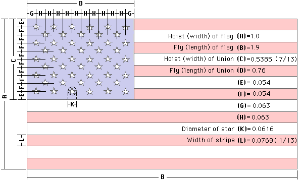
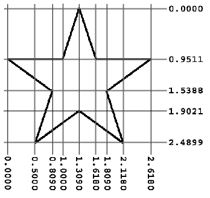

SVG Club Logo
#############

When I first joined the club, their logo was found only in an image file. The
original artist created the logo manually, then scanned it for club use. The
original is no longer available.

I decided that we needed a more permanent logo, one that could be scaled for a
variety of purposes. I also decided that we needed a badge we could use on
model airplanes, or club membership cards.

The solution was to take the image file and see if I could turn it into a pure
SVG file. This note details the process I went through to come up with the new
logo.

Logo Composition
****************

The image file had only a few basic elements:

    * The US Flag masked by a heart shape

    * The heart shape path

    * A Modeler launching an airplane

    * The Airplane itself

    * The name "HAFFA" styled in what looked like the Papyrus font

Flag Geometry
*************

The dimensions of the flag are well defined. Here is the basic geometry from
http://https://www.chamberofcommerce.org/usflag/flagspecs.html:

The stars are positioned at the center of a circle of the defined radius. Each
point is located at an angle of 360/5 = 72 degrees, making the height of the
star a bit shorter than the width. Here is another image showing the positions
of the points that make up each star:

With these two figures, we can build a basic flag file using fairly simple SVG
commands.

Logo Canvas
***********

Our basic canvas will be a standard US Letter paper. We will build the logo and the badge so they can be printed out on any inkjet printer.

SVG traditionally uses pixels as a basic unit of measure. However, pixels vary in size as you switch to different devices. We will use the inch as a basic measurement. Remember, SVG is a vector format, meaning we can scale the final image to suit our needs.

